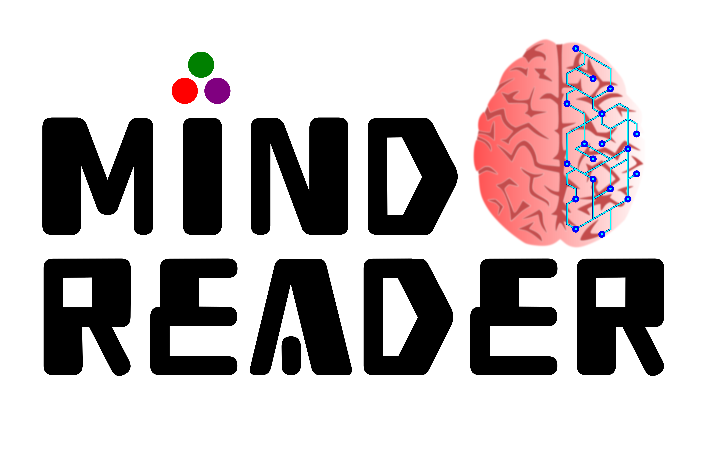

<!-- Title -->
<h1 align="center">
  MindReader
</h1>

<!-- description -->
<p align="center">
  <strong>Unsupervised Artificial Intelligence framework for EEG state detection</strong>
</p>

<!-- Information badges -->
<p align="center">
  <a href="https://www.repostatus.org/#active">
    
  </a>
  <a href="https://mit-license.org">
    
  </a>
  <a href="https://DanielRivasMD.github.io/MindReader.jl/stable">
    
  </a>
  </a>
  <a href="https://DanielRivasMD.github.io/MindReader.jl/dev">
    
  </a>
</p>

<!-- Community -->
<p align="center">
  <a href="https://github.com/DanielRivasMD/MindReader.jl/discussions">
    
  </a>
  <a href="https://github.com/SciML/ColPrac">
    
  </a>
</p>

<!-- Version and documentation badges -->
<p align="center">
  <a href="https://github.com/DanielRivasMD/MindReader.jl/releases">
    
  </a>
</p>

<!-- CI/CD badges -->
<p align="center">
  <a href="https://hub.docker.com/r/eakkuratov/final_dummy">
    
  </a>
</p>



## Description

**MindReader** is a unsupervised artificial intelligence framework for electroencephalography signal state detection.

## Installation

```julia
julia>]
pkg> add MindReader
```

To exit Pkg mode, just backspace. Once the package is installed it can be imported with:

```julia
julia> using MindReader
```

For more information, see the [Pkg documentation](https://docs.julialang.org/en/v1/stdlib/Pkg/).

## Usage

## Docker

## Citations

If you use **MindReader** or derivates in your work, please consider citing the code record.

## Contributing and Support

[](https://github.com/SciML/ColPrac)

In general contributions should follow [ColPrac](https://github.com/SciML/ColPrac). If you are interested in extending/improving **MindReader**, head to the [discussions](https://github.com/DanielRivasMD/MindReader/discussions) to reach out. For support with using **MindReader**, please open an [issue](https://github.com/DanielRivasMD/MindReader/issues/new/) describing the problem and steps to reproduce it.

## License

This package is licensed under the MIT Expat license. See [LICENSE](LICENSE) for more informaiton.

---

**Author's Note**: This package is still under active development and is subject to change.
